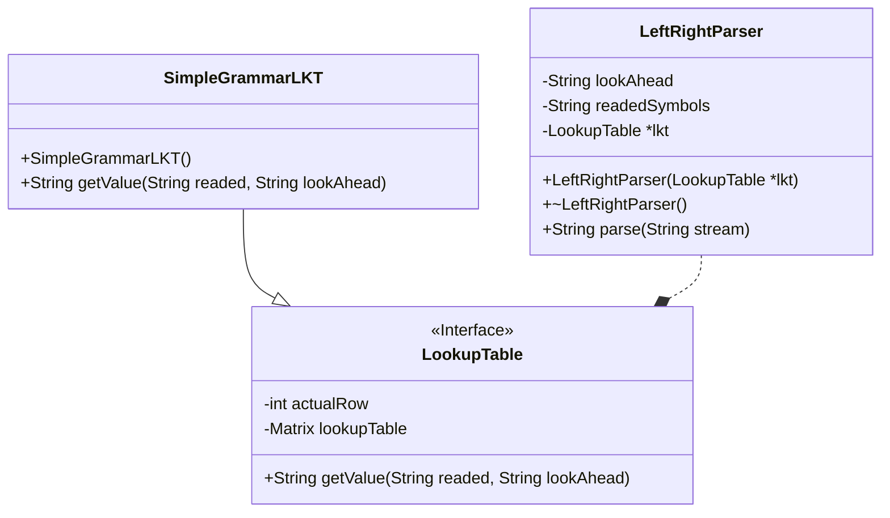

# LR(1) Parser

A Bottom Up LR(1) Parser done in C++ to recognize a simple language, but still extensible enough to be expanded.

## Descriptions

## Test Grammar
- S : S * S | A
- A : 1 | 2 | 3 | 4 | 5 | 6 | 7 | 8 | 9 | $\epsilon$

## Lookup Table:
| state | regra atual               | int | *   | eof |
| ----- | ------------------------- | --- | --- | --- |
| 0     | Objetivo -> $\cdot$ S * S | 2    |    |     |
| 1     | Objetivo -> Value * $\cdot$ S | 2   | 0   | Finalizado   |
| 2     | S -> Value $\cdot$               |     | 1   |     |